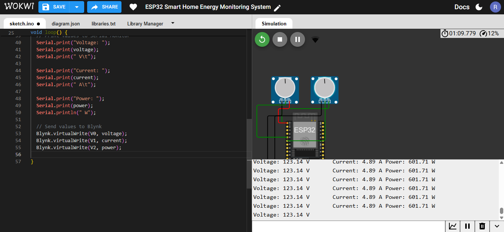
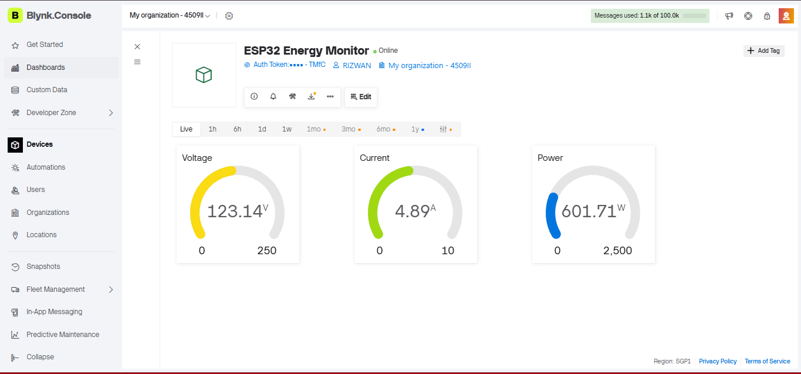

# Smart Home Energy Monitoring System Using ESP32

## Overview

This project demonstrates the design and simulation of a **Smart Home Energy Monitoring System** using the **ESP32 microcontroller**. The project was developed step by step using the **Wokwi simulator** before implementing the actual hardware prototype.

The system is capable of monitoring electrical parameters such as **voltage**, **current**, and **power consumption**. The measured values are transmitted to the **Blynk IoT Platform**, where they can be monitored in real time through a cloud-based dashboard.

This project serves as a foundation for a future hardware implementation using real voltage and current sensors. Similar ESP32-based energy monitoring systems are widely used in smart homes, industrial monitoring, and IoT-based energy management applications.

---

## Features

- ESP32-based Energy Monitoring System
- Analog Sensor Reading
- Voltage Measurement
- Simulated Current Measurement
- Real-Time Power Calculation
- Blynk IoT Dashboard Integration
- Wokwi Circuit Simulation
- GitHub Project Documentation
- Step-by-Step Project Development
- Future Hardware Upgrade Support

---

## Development Progress

- ✅ **Day 1** – Project Planning & Documentation
- ✅ **Day 2** – ESP32 Blink LED Simulation
- ✅ **Day 3** – Analog Sensor Reading
- ✅ **Day 4** – Voltage Reading & ADC Conversion
- ✅ **Day 5** – Current Measurement & Power Calculation
- ✅ **Day 6** – IoT Dashboard, Documentation & GitHub Repository
- ✅ **Day 7** – Final Integrated Smart Home Energy Monitoring System with Blynk IoT Dashboard

---

## Final Project

The final project integrates the **ESP32 microcontroller** with the **Blynk IoT Platform** to simulate a Smart Home Energy Monitoring System.

Two potentiometers are used in the Wokwi simulation to represent the outputs of voltage and current sensors. The ESP32 continuously reads the analog values, converts them into voltage and current, calculates electrical power, and transmits the results to the Blynk cloud dashboard in real time.

This simulation demonstrates the complete workflow of an IoT-based energy monitoring system before implementing the hardware version.

---

## Future Hardware Version

The simulation will be upgraded into a real hardware project using:

- ESP32 DevKit V1
- ZMPT101B AC Voltage Sensor
- ACS712 Current Sensor
- Blynk IoT Platform
- Breadboard & Jumper Wires
- OLED Display (Optional)
- Relay Module (Optional)

The hardware version will measure real electrical parameters and display live energy data through the Blynk dashboard.

---

## Wokwi Simulation Projects

### Day 2 – ESP32 Blink LED Simulation
https://wokwi.com/projects/471075690246161409

### Day 3 – ESP32 Analog Sensor Reading
https://wokwi.com/projects/471147536936393729

### Day 4 – ESP32 Voltage Reading
https://wokwi.com/projects/471225538316511233

### Day 5 – ESP32 Current Measurement & Power Calculation
https://wokwi.com/projects/471226533325050881

### Day 7 – Final Smart Home Energy Monitoring System
https://wokwi.com/projects/471392069130606593

---

## Project Screenshots

### Wokwi Simulation

### Blynk Dashboard

---

## Tools & Technologies Used

- ESP32 DevKit V1
- Arduino IDE
- C++
- Wokwi Simulator
- Blynk IoT Platform
- GitHub
- Google Docs

---

## Skills Demonstrated

- ESP32 Programming
- Embedded Systems
- Internet of Things (IoT)
- Analog-to-Digital Conversion (ADC)
- Sensor Data Processing
- Voltage & Current Measurement
- Electrical Power Calculation
- Blynk Cloud Integration
- GitHub Version Control
- Technical Documentation

---

## Project Documentation

The project has been documented day by day and includes:

- Project Planning
- Daily Development Progress
- Wokwi Simulation Links
- Source Code
- Circuit Screenshots
- Blynk Dashboard Screenshots
- Technical Documentation

---

## Future Improvements

- Replace simulated sensors with:
  - ACS712 Current Sensor
  - ZMPT101B AC Voltage Sensor
- Measure real Voltage, Current, Power and Energy (kWh)
- Improve sensor calibration and measurement accuracy
- Store historical energy consumption data
- Send high power usage notifications
- Design a custom PCB
- Develop a mobile-friendly dashboard

---

## Project Status

✅ **Version 1.0 (Simulation)** — Completed

🔄 **Version 2.0 (Hardware Implementation)** — Planned

---

## Author

**Rizwan Ahmed**

Electrical and Electronic Engineering (EEE) Student

BRAC University

---

## License

This project was developed for educational and academic purposes.
